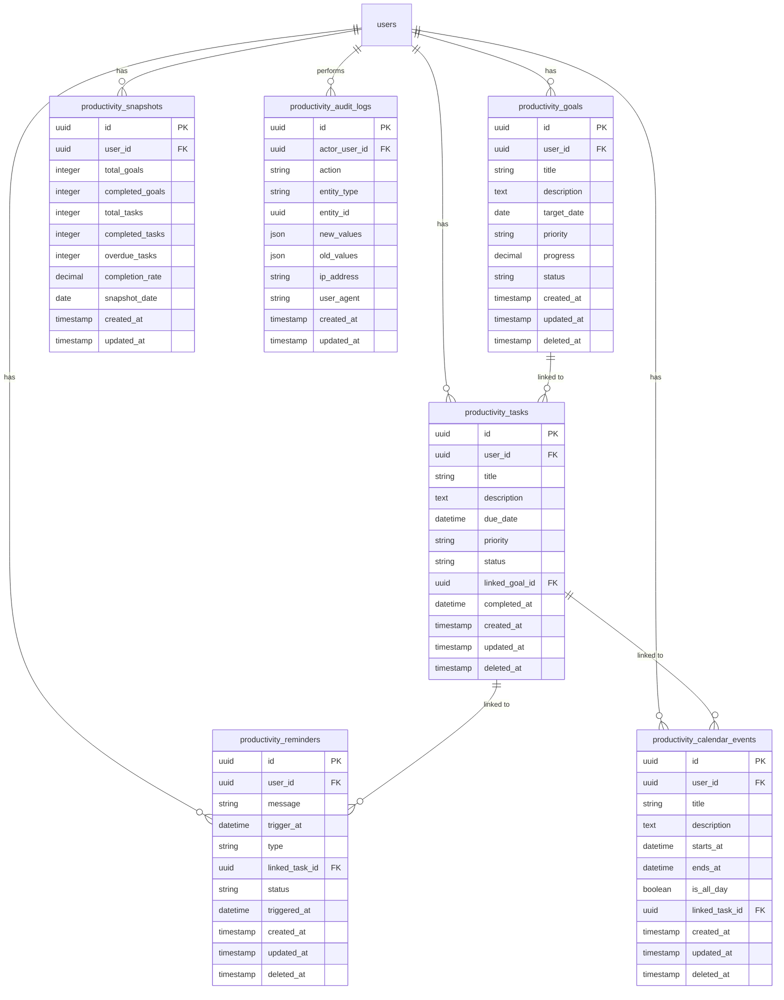

# Productivity Module — Database Design

**Module:** Productivity  
**Last Updated:** 2026-06-20  
**Convention:** ADR-005 (UUID PKs, `productivity_` prefix)

---

## Entity Relationship Diagram

---

## Tables

| Table | Purpose |
|-------|---------|
| `productivity_goals` | Student goals and objectives |
| `productivity_tasks` | Individual tasks linked to goals or standalone |
| `productivity_reminders` | Notifications for tasks and events |
| `productivity_calendar_events` | Calendar events and appointments |
| `productivity_snapshots` | Historical productivity metrics |
| `productivity_audit_logs` | Critical operation audit trail |

---

## Indexes

- All foreign keys indexed
- Indexes on `user_id` for all tables
- Indexes on `status` for goals, tasks, reminders
- Indexes on `target_date`, `due_date`, `trigger_at`, `starts_at`, `ends_at` for date queries
- Indexes on `priority` for filtering
- Indexes on `snapshot_date` for snapshots
- Indexes on `action`, `entity_type`, `entity_id` for audit logs

---

## Referential Integrity

- `productivity_goals.user_id` → `users.id` (cascade delete)
- `productivity_tasks.user_id` → `users.id` (cascade delete)
- `productivity_tasks.linked_goal_id` → `productivity_goals.id` (restrict)
- `productivity_reminders.user_id` → `users.id` (cascade delete)
- `productivity_reminders.linked_task_id` → `productivity_tasks.id` (restrict)
- `productivity_calendar_events.user_id` → `users.id` (cascade delete)
- `productivity_calendar_events.linked_task_id` → `productivity_tasks.id` (restrict)
- `productivity_snapshots.user_id` → `users.id` (cascade delete)
- `productivity_audit_logs.actor_user_id` → `users.id` (restrict)

Cross-module FK only to Shared `users` table (per ADR-003).
